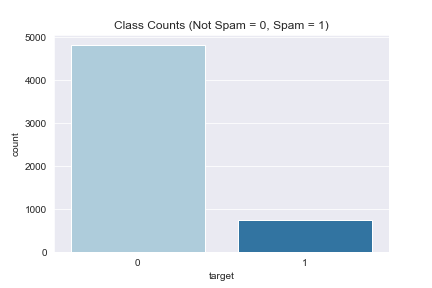

# SPAM-SMS-NLP-Analysis-and-Prediction
Using supervised natural language processing to predict whether an SMS message is spam or ham (not-spam).

We use both logistic regression and random forest to classify outcomes. Due to the class imbalance of this problem, I will walk through multiple ways of dealing with this issue when it comes to predictions. I will also adress the other areas that it may affect.

### SMS Spam Classification

This project I will be looking into SMS text data from multiple sources all collected by the team [Tiago A. Almeida](http://dcomp.sor.ufscar.br/talmeida/) and [José María Gómez Hidalgo](http://www.esp.uem.es/jmgomez). For more information on how they collected this data check it out [here](http://www.dt.fee.unicamp.br/~tiago/smsspamcollection/).

Some notable sources used while performing this analysis and classification: 
- [Ultimate guide to deal with Text Data (using Python)](https://www.analyticsvidhya.com/blog/2018/02/the-different-methods-deal-text-data-predictive-python/)

The data here is a collection of 747 Spam texts along with 4,827 non-spam (HAM) texts. The file is formatted as a plain text file.

### Feature Engineering
The first phase consisted of feature engineering, to help with a single logistic regression:

Before any of this I did a little bit of text exploring to see if I could see anything that may or may not help me--this was crucial for choosing __'flag words'__. Items like word count, char counts, number of numerics, number of upper case, etc. are pretty common practice, so they are great features to add to your data set before cleaning. 

1. word count
2. character count
3. Number of numerics
4. Number of upper case
5. Number of Exclamation Points (!)
6. Number of Flag Words
7. Links in message
8. Count of stop words

### Data Preprocessing

Next, we need to move into data cleaning. This section will be very important for the remaineder of this project and the models we run. In the next few cells we will:
1. create a function to remove all punction
2. lower case all of the words in our messages
3. remove stop words
4. check for spelling and correct where needed
5. remove frequent
6. remove rare/uncommon words

#### Next in the process it was necessary to lemmatizing. 
__More info on Lemmatizing__: it is a way to reduce a word to it's base. So, a word like running would be lemmatized to run, the same for movies to movie and potatoes to potato. This is similar to stemming, but is esentially starter and doesn't cut words down that may have the same stem with two separate meanings.

So, this is an interesting problem in the project. We've come to the next part, where typically I would train-test split. However, due to the class imbalance, it may be better to simply using different resampling methods so that we do not lost any of the minorty class and hopefully improve our predictions.

Below is a graph of the the count of each class (Spam or Ham) of our data:
</img>

As you can see from the image above the amount of spam messages we actually have is far fewer than the ham messages, only about 16% of the data is made up of the __Spam__ class. If we decided to proceed with train-test split, we could potentially take most of those into the test data and leave very little for the train data. Additionally, it will probably make this difference even bigger. 

Due to this I defined a function that created a tf-idf vectorizer and returned the vector. TF-IDF stands for term frequency–inverse document frequency. As described by wikkipedia as: ["a numerical statistic that is intended to reflect how important a word is to a document in a collection or corpus."](https://en.wikipedia.org/wiki/Tf–idf)

